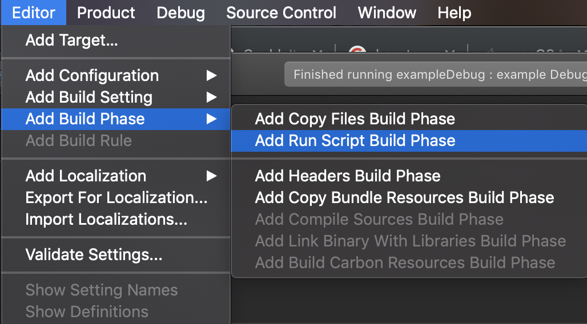

Introduction
============
This is an OpenFrameworks addon for using the Kinect V1 (macos so far) and V2 with OpenNI.
Support for the Kinect V2 on Linux/Windows/Mac using the OpenNI driver from Libfreenect2 (https://github.com/OpenKinect/libfreenect2/). 

Generally the point of this would be to use the NiTE skeleton tracking library. NiTE is no longer publicly available, but the binaries are included in this addon. If you just need to get the Kinect's depth texture, you're probably better off using my other addon which doesn't require OpenNI, https://github.com/pierrep/ofxLibFreenect2

The included libfreenect2-openni driver is using the OpenCL back-end. Compile your own version if you need Cuda or any one of the other Libfreenect2 back-ends.

It also supports the Orbbec Astra camera, but only for receiving the depth data, not skeleton tracking.

Setup
=====
This addon has been tested on openframeworks 0.10.1. If you want to use it on 0.9.8, please use the branch with the same name.


All Platforms
-------------
Logging is enabled in 3 ways.

Libfreenect2 logging is controlled via: 
`device.setLogLevel(OF_LOG_NOTICE);
`
You can use the normal OF log constants to choose what level of logging you want. If you don't call this function, logging defaults to OF_LOG_SILENT

OpenNI.ini controls the OpenNI2 logging. On Windows should edit the file in your bin directory to turn this on. On Linux you should edit the file in ofxNI2/libs/OpenNI2/lib/linux64/

NiTE.ini controls the NiTE logging. You should edit the file in your bin directory to turn this on.


Linux
-------
Create a project using the project generator, including this addon

Copy the NITE.ini file from copy_to_bin_folder/linux64 to your application's bin folder. If you aren't using NITE (no skeleton tracking, just depth) you can ignore this step.

If you want to use the kinect V1 with this addon on Linux you'll need to compile the libfreenect-OpenNI2 driver (if you do please make a PR with it).
Follow the instructions at https://github.com/OpenKinect/libfreenect/tree/master/OpenNI2-FreenectDriver
Then put the compiled driver in `libs/OpenNI2/lib/linux64/OpenNI2/Drivers`

OSX
---
Use project generator and then in Xcode:

Add a run script : 

```
cp -R ../../../addons/ofxNI2/libs/OpenNI2/lib/osx/ "$TARGET_BUILD_DIR/$PRODUCT_NAME.app/Contents/MacOS/"; 

cp -R ../../../addons/ofxNI2/libs/NiTE2/lib/osx/libNiTE2.dylib "$TARGET_BUILD_DIR/$PRODUCT_NAME.app/Contents/MacOS/libNiTE2.dylib";

cp -R ../../../addons/ofxNI2/libs/NiTE2/lib/osx/NiTE.ini "$TARGET_BUILD_DIR/$PRODUCT_NAME.app/Contents/Resources/NiTE.ini";

cp -R ../../../addons/ofxNI2/libs/NITE2-data/NiTE2 "$TARGET_BUILD_DIR/$PRODUCT_NAME.app/Contents/Resources/";

install_name_tool -change libOpenNI2.dylib @executable_path/../MacOS/libOpenNI2.dylib "$TARGET_BUILD_DIR/$PRODUCT_NAME.app/Contents/MacOS/$PRODUCT_NAME";
```
If you are using MacOS Mojave 10.14.4 add the next lines to the run script.
Essentially the drivers files need to be copied next to the executable in the bin folder.

```
cp ../../../addons/ofxNI2/libs/OpenNI2/lib/osx/OpenNI2/Drivers/* "$TARGET_BUILD_DIR/"; 

cp -R ../../../addons/ofxNI2/libs/NiTE2/lib/osx/libNiTE2.dylib "$TARGET_BUILD_DIR/libNiTE2.dylib";

```

Visual Studio
-------------
Tested using Visual Studio 2017 on Windows 10.

You will need to install the libusbK  driver here in order to use the Libfreenect2 drivers:
https://github.com/OpenKinect/libfreenect2/blob/master/README.md#windows--visual-studio

Kinect V1 support is uncertain. 

Create a project using the project generator, including this addon

You will need to copy the contents of copy_to_bin_folder/vs/x64/ to your application's bin folder. The project generator will do this for you however.

